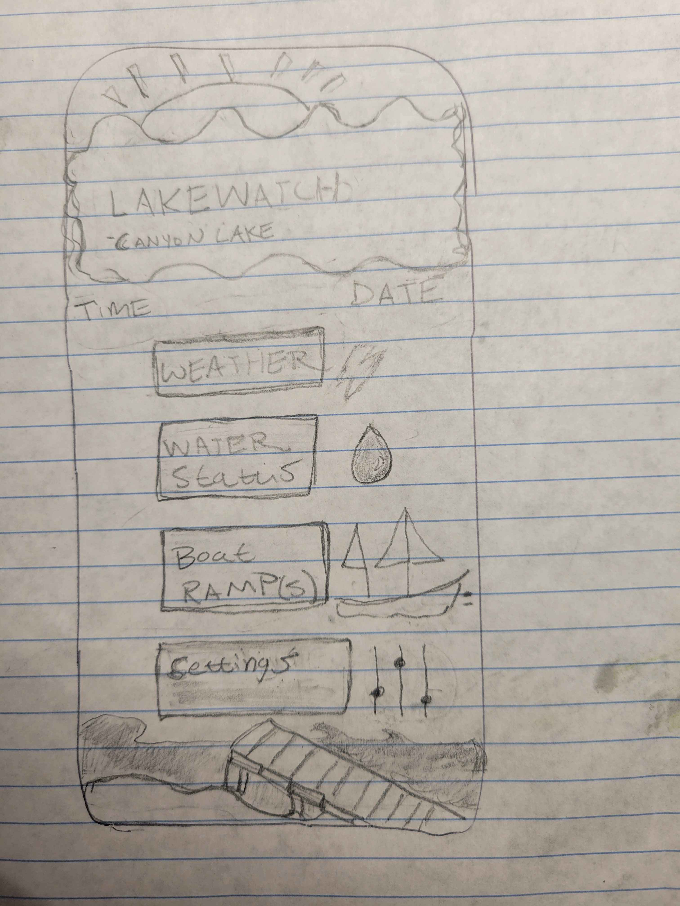
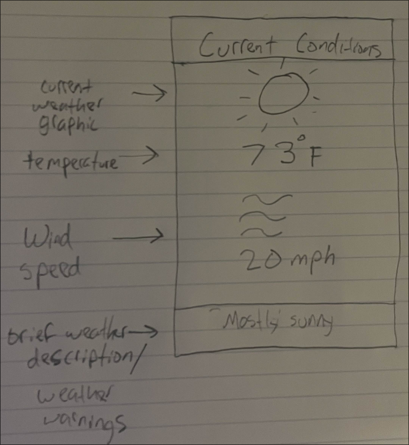
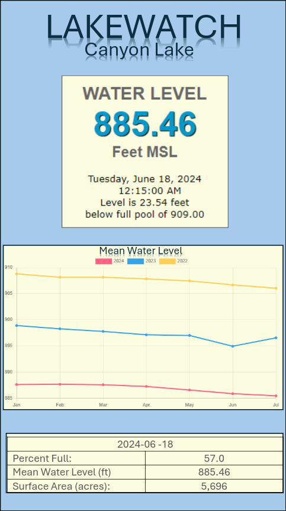
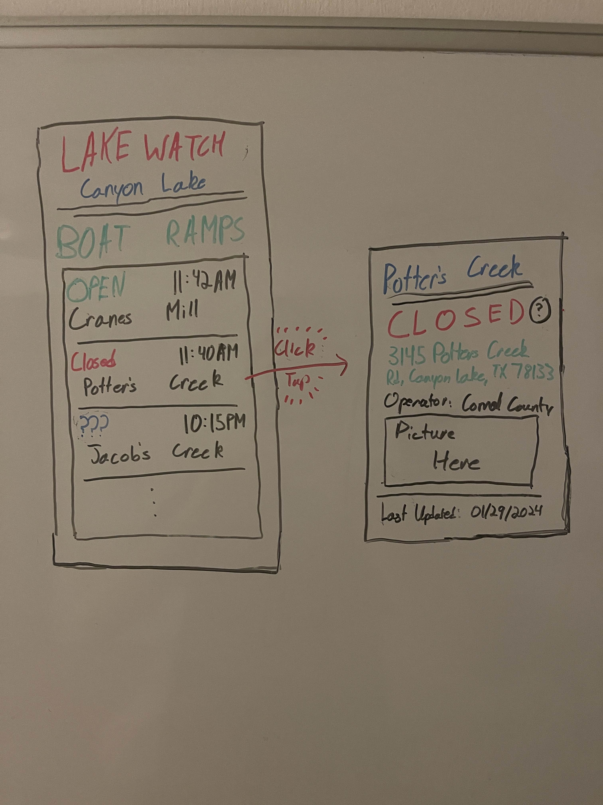
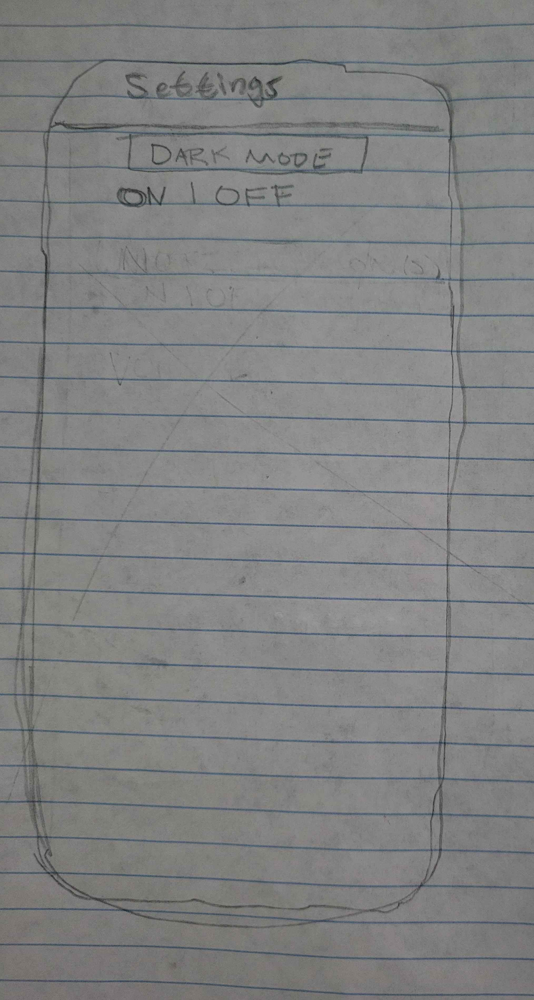

# Project Proposal

> **Objective**: The purpose of this assignment is to guide students in creating a comprehensive project proposal for an
> Android application. This proposal will serve as the foundation for the semester-long project, outlining the project's
> goals, scope, features, and development plan.

## Project Title and Overview

> - Choose a catchy and descriptive title for your Android application project.
> - Provide a brief overview of the project, highlighting its purpose and potential impact.

### Project Title

**LAKEWATCH: Canyon Lake**

### Overview

Our app will track a few things: water data of the lake, like water level, weather forecasts, like wind and temperature,
and boat ramp statuses, like what boat ramps are open or closed.

The app will be useful for informing lake-goers of conditions at the lake, especially of the boat ramps. Furthermore,
it'll bring awareness to Lake Canyon's falling water levels and hopefully cause concerns on whether Lake Canyon will
even be around in another decade.

## Project Goals and Objectives

> - Clearly define the goals and objectives of your Android application. What problem does it solve, and what benefits
>   will users gain?

- Problem: It's hard to know statuses on various services and conditions of Lake Canyon as a bunch of different
  organizations have differing levels of access and presentation of Lake Canyon data.
- Solution: Provide those statuses in a single centralized location that's easy to use.

## Target Audience

> - Identify and describe the target audience for your application. Consider demographics, interests, and needs that
>   your app addresses.

- Locals of Lake Canyon
- Tourists intending to go to Lake Canyon
- Boaters and sailors on Lake Canyon (like those at Lake Canyon Yacht Club)

## Scope of the Project

> - Outline the features and functionalities that your Android application will include. Clearly define what is within
>   the scope of this project and what might be considered for future enhancements. Your app must take input from the
>   user and also incorporate data - plan for file I/O.

- Water Data
  - Historical data
  - Water level
  - Water temperature
- Weather Data
  - Wind speed
  - Temperature
  - Weather conditions (storms, lightning)
- Boat ramp information
  - Boat Ramp status, open or closed
  - Addresses of the ramps
  - Images of the ramps

This data will be incorporated by reading an API we're writing and a cache we maintain local to the app. Please see
[here](https://github.com/CodingIsOurPassion/CodingIsOurPassion/tree/main/LakeWatchAPI) for the API and
[here](https://github.com/CodingIsOurPassion/CodingIsOurPassion/tree/main/LakeWatchScraper) for how we're getting the
data.

## User Interface (UI) Design

> - Provide a high-level overview of the user interface design. Include sketches and descriptions of the app's key
>   screens and interactions. The application should have a minimum of 4 views (screens).

Our app's minimal viable product contains 4 to 5 views.

1. Our first view is the home view, acting as the primary portal to all other views within the app.
2. The second view is the weather view, containing data about weather conditions at Canyon Lake.
3. The third view is the water data view, containing information about water level, how full the lake is, historical
   data, and more relating to Lake Canyon's water.
4. The fourth view is the boat ramp status view, containing information about if a ramp is open or closed, their
   addresses, and more.
5. The last view is a settings menu, which currently contains only a dark mode toggle, but based on some discussions may
   include a few additional features we're hammering out over the next week.

## Competition

> - Identify your competition in the market. List 3 similar applications found in the apps store (include links).

- [https://canyonlake.app](https://canyonlake.app)
- [https://weather.gov](https://forecast.weather.gov/MapClick.php?lat=29.87&lon=-98.25)
- [Texas Lake Levels](https://play.google.com/store/apps/details?id=com.chaossoftware.lakeLevel)
- [US Army Corps of Engineers > Lake Canyon](https://www.swf-wc.usace.army.mil/canyon/)

## Team Agreement

> - Download a copy of the team agreement document found
>   [here](https://docs.google.com/document/d/1_k0sYuWC1sus3h5KOKiiPMZuqXfCBS3ywZpJo86izgg/edit?usp=sharing).
>   Collaboratively review the agreement as a team, make any necessary modifications as specified, proceed to sign the
>   team agreement, and attach it to the submission.

- See the attached document

## Conclusion

> - Summarize the key points of your project proposal

- Show data on Canyon Lake
  - Water data
  - Weather data
  - Lake Services information
- Should better inform lake-goers of lake conditions and bring attention to the lake's falling water levels.
